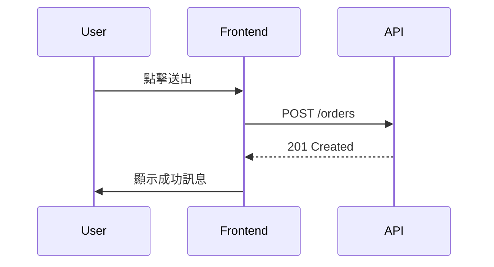

# 流程圖規則

## 核心原則

**不為畫而畫**。流程圖只在三種情境下對讀者真正有幫助：

| 情境 | 圖表類型 | 使用時機 |
|---|---|---|
| 資料流變化 | Flowchart / 資料流向圖 | MR 改變了資料從哪裡來、經過什麼處理、到哪裡去 |
| 狀態流轉 | State Diagram / 狀態機圖 | MR 涉及複雜的狀態管理（表單流程、多步驟操作、權限狀態） |
| 請求流程 | Sequence Diagram / 時序圖 | MR 涉及 API 串接、多服務互動、認證授權流程 |

## 不該畫的情境（反例）

- **UI 元件樹**：用 React 元件名稱表達就好，畫成樹狀圖只是浪費空間。
- **檔案結構**：用 `tree` 指令或文字列表更精準。
- **單純的條件分支**：if/else 兩個分支寫成文字「條件 A 走 X，否則走 Y」比畫圖更快讀。
- **單純的 CRUD**：增刪改查的流程過於通用，畫圖無資訊增量。
- **沒有真實變化的圖**：如果 MR 沒改動流程，只是改命名或樣式，不需要圖。

## 渲染方式

使用 Mermaid 語法產出流程圖，並透過 `mcp__figma__generate_diagram` 工具渲染為可嵌入的圖檔。

範例 Mermaid 區塊：

````markdown

````

## 圖的品質檢查

畫完問自己這三個問題，全部回答「是」才保留：

1. 讀者看完圖會比讀文字快理解嗎？
2. 圖上每個節點都承載了文字難以表達的關係嗎？
3. 如果拿掉這張圖，讀者會卡在哪裡？

如果第 3 題答不出來，刪掉。
