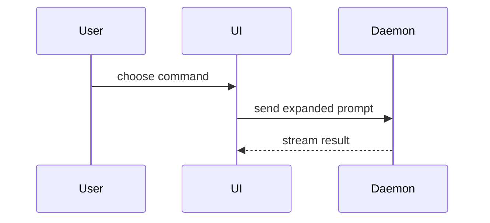

# fe-show-me — 用視覺形式講重點

改編自 [humanlayer/skills 的 show-me](https://github.com/humanlayer/skills/blob/3c2629142c5d437428269b1b722b08c0b87f574d/plugins/show-me/skills/show-me/SKILL.md)，補上三條在地化安全規則（資料一律用假的、HTML 產出落地與自包含、不主動執行 open）。差異與理由見 README「與原始版本的差異」。

跳過鋪陳，直接挑**最小的、能講清楚重點的視覺形式**。以下七種依情境擇一或搭配使用，不必全用，用太多反而干擾。

- 邏輯或演算法用 pseudocode：

```text
on(save)
  if content is unchanged
    return cached result
  write new content
  return fresh result
```

- Runtime 呼叫流程用 call tree：

```text
submitForm
  createSession
    persistPrompt
    launchAgent
  navigateToSession
```

- UI 結構用 component tree，把 hook、模組邊界標出來：

```tsx
<SessionPage> (apps/example/src/routes/session.tsx)
  useSessionEvents()
  <SessionToolbar>
    <RunSkillButton> (packages/ui)
```

- 檔案職責或大範圍重構用 shallow file tree：

```text
src/
├── commands/       # parses user actions
├── sessions/       # owns session state
└── transport/      # sends API requests
```

- 元件互動、控制流、資料流用 Mermaid：



- 重點是「改了什麼」而非全貌時用 `diff`，diff 的形狀要對應主題：

改元件結構：

```diff
 <SessionPage>
   useSessionEvents()
   <SessionToolbar>
+    <RunSkillButton />
   <SessionTimeline>
+    <SkillResultCard />
```

改檔案結構：

```diff
 src/
 ├── commands/
+│   └── show-me.ts       # expands the slash command
 ├── sessions/
-└── transport.ts
+└── transport/
+    ├── client.ts
+    └── stream.ts
```

改呼叫流程：

```diff
 submitForm
   createSession
     persistPrompt
+    expandSkillMention
     launchAgent
-  navigateToSession
+  navigateToSession
+    subscribeToEvents
```

改狀態或控制流：

```diff
 on(save)
-  write content
+  if content is unchanged
+    return cached result
+  write new content
+  invalidate cache
```

- 大部分內容都是新增、省略上下文會讓人看不出歸屬或順序、或用戶需要可直接複製的目標形狀時，show 整段：

```ts
function expandSkill(command: string): string {
  const skillName = command.slice(1)
  return `use the ${skillName} skill`
}
```

## HTML 形式（改動最大的一種，照下面規則走）

密度太高、Mermaid 表達不了的視覺比較（版面、狀態比較、資訊圖表），才用單一 HTML 檔。原始版本要求「match the product's colors...use real labels and data」並直接 `open` 檔案——這兩點在處理真實業務資料的專案上有風險，本版改成：

1. **資料一律用假資料／佔位資料**。不可把真實客戶姓名、帳號、金額、身分資訊、API 實際回應內容寫進 HTML。要示範資料形狀就編一組看起來合理但明顯是假的（如 `王小明`／`ACC-000001`）。
2. **HTML 必須 self-contained**：CSS 全部 inline 或 `<style>` 內嵌，禁止引用任何外部 CDN（Tailwind Play CDN、Mermaid CDN 等一律不行），不發任何外部請求。
3. **產出路徑固定** `.claude/tmp/show-me-{description}.html`。動手前檢查專案 `.gitignore` 是否已包含 `.claude/tmp/`，沒有就加一行；絕對不寫進 repo 的原始碼路徑（`src/`、`app/` 等）。
4. **不主動執行 `open`**（macOS-only，且會在無 GUI 環境或別人電腦上失效）。產出後直接印出絕對路徑告知使用者自行開啟：

```
已產出：.claude/tmp/show-me-{description}.html
```

## 使用原則

視覺放在它支撐的那段文字旁邊。只留下回答當下問題所需的呼叫、檔案、props、state、邊界，不要為了完整而畫多餘的節點。

七種形式可以用一種、可以搭配幾種，不太可能全部用上；用你的判斷，別把使用者淹沒。
