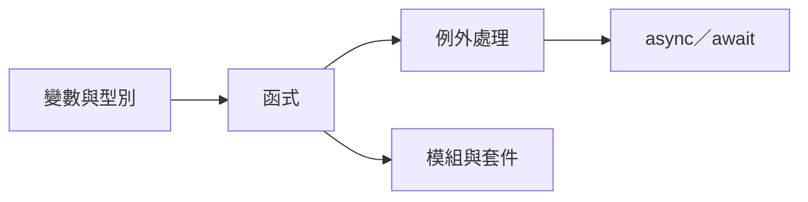

# 階梯模板（ladder.md）

每級四項都要填。過關標準要能被第三人檢查；程式類主題一律寫成可驗證產物。

~~~markdown
# <主題>：學習階梯

目標：<期限> 前做出 <可驗證成果>
目前程度：L<n>（<一句話為什麼判在這級>）

## 概念依賴圖

## L1 新手

- **必懂**：<概念 1>、<概念 2>；能做到 <實作能力>
- **常見錯誤**：<錯誤或誤解 1>；<錯誤或誤解 2>
- **練習**：
  1. <5 分鐘小練習>
  2. <30 分鐘練習>
  3. <把前兩個接起來的練習>
- **過關標準**：<可驗證產物，例：寫一支 20 行的腳本讀 CSV 印出總和，跑得過 3 個測資>

## L2 能跟著做

（同上四項）

## L3 能獨立解決小問題

（同上四項）

## L4 能設計與取捨

（同上四項；過關標準加一條「能解釋一個取捨：為什麼選 X 不選 Y」）

## L5 能獨立做專案

（同上四項；過關標準就是目標那個可驗證成果）
~~~

## 取捨原則

- 每級「必懂」不超過 5 個概念；超過代表這級該拆。
- 練習由小到大，第一個要能 5 分鐘內做完，讓人有起步的地方。
- 依賴圖只畫「必須先會」的邊，不畫「有幫助」的邊。
- 整份控制在 80 行內。
