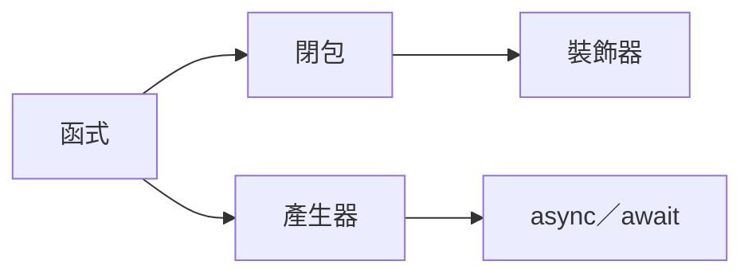
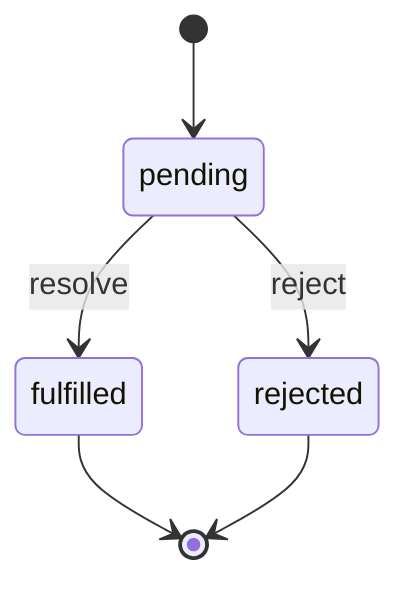
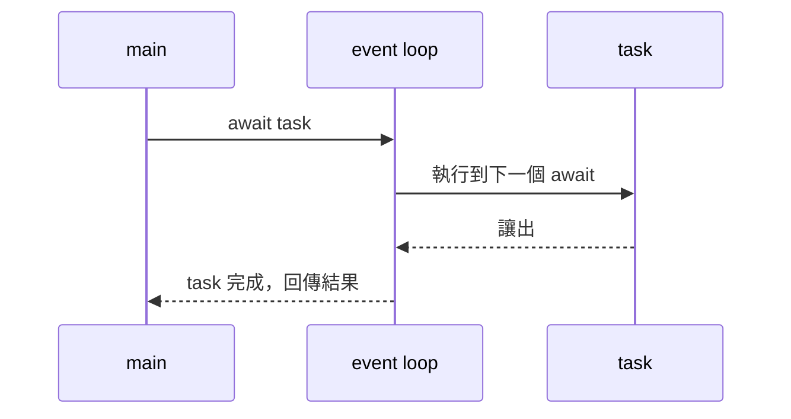

# 畫圖判準與形式

這支 skill 自己畫圖，不依賴其他 skill。輸出 Mermaid 或純文字，直接放在它要說明的那段文字旁邊，放進對話與檔案都行；不產 HTML。

## 什麼時候畫

只有四種情境值得畫，其他用文字：

| 情境 | 用什麼 | 例 |
|---|---|---|
| 概念依賴（先會 A 才能學 B） | Mermaid `graph LR` | 階梯的依賴圖 |
| 流程或分支（做了 X 之後會走到哪） | 文字流程 | 收到請求 →（未登入）→ 擋下 →（已登入）→ 放行 |
| 狀態流轉（一個東西有幾種狀態、怎麼變） | Mermaid `stateDiagram-v2` | Promise pending → fulfilled／rejected |
| 時序（誰先呼叫誰、誰等誰） | Mermaid `sequenceDiagram` | event loop 與 await 的交棒 |

## 什麼時候不畫

- 單純 if／else：一句話講完。
- 純資料結構（欄位有哪些）：用表格或程式碼。
- 使用者已經答對的東西：不用圖強化。
- 一張圖要超過 12 個節點才講得完：代表該拆成兩張，或該改回文字。

## 範例

**依賴圖**（階梯用）：



**文字流程**（導師模式最常用，成本最低）：

```
await 一個 coroutine
  → 還沒完成：交棒回 event loop，去跑別的 task
  → 完成了：拿到結果，從這行往下走
```

**狀態圖**：



**時序圖**：



## 品質檢查

- 節點名稱用使用者聽得懂的詞，不用縮寫。
- 每條邊都有意義；「有幫助」的關係不畫，只畫「必須」。
- 圖下方一句話說這張圖要看的重點是什麼。
